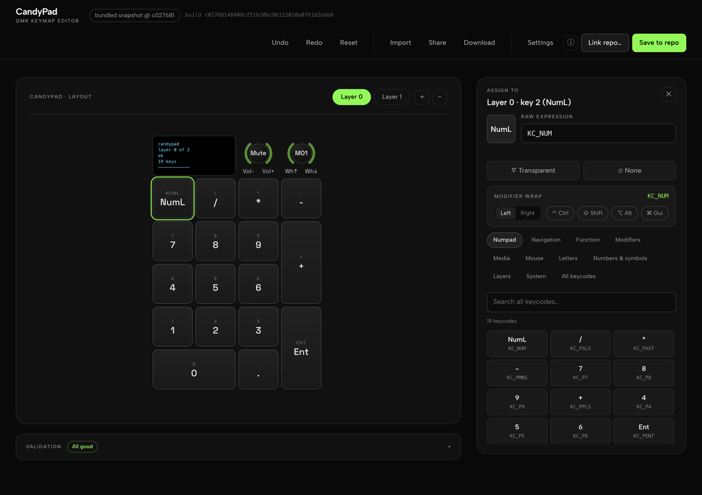

# CandyPad — QMK userspace

Firmware for the [CandyPad](https://candykeys.com/product/candypad-keyboard) macropad
(19 keys, 2 rotary encoders, 128x32 OLED), built as a **QMK userspace** against the
binepad QMK fork.

The layout lives in a single JSON file:

```
keyboards/binepad/candypad/keymaps/candypad_keymap/keymap.json
```

Edit it, commit it on any branch, push. GitHub Actions compiles the `.bin` and
attaches it to the run.

Editing it by hand is optional: there is a visual editor for it at
**<https://lukdog.com/CandyPad/>**.

## The editor

[](https://lukdog.com/CandyPad/)

A static, single-page keymap editor for this repo, deployed to GitHub Pages from
`editor/`. It edits `keymap.json` — the same file QMK compiles — and can write it
straight back into a local clone of your fork.

It exists because the vendor's own configurator at `candypad.app` cannot express a
modified keycode (there is no way to put `LCTL(KC_LEFT)` on a key), and the firmware
it shipped had layers no key could reach and mouse keycodes assigned while mousekey
was switched off. This editor takes any expression valid inside `LAYOUT()`, and
validates the keymap before you spend a minute and a half building it.

### What it does

- Assign any keycode by clicking a key or a knob, including nested modifiers such as
  `LCTL(LSFT(KC_TAB))`, layer keys and `QK_BOOT`.
- Browse the whole QMK keycode table through task categories (Numpad, Navigation,
  Media, Mouse, Layers, …) instead of QMK's internal groups, or search it.
- Set all three actions of each rotary encoder, per layer — counter-clockwise, press,
  clockwise. Layers and encoders are added and removed together, because a mismatch
  fails a `STATIC_ASSERT` at compile time rather than validation.
- Edit the OLED brightness, timeout and custom render code that end up in `config.h`
  and `oled.c`.
- Flag unreachable layers, keycodes whose feature is disabled, and keycodes this
  hardware cannot perform (there are no LEDs on this board). The same validator runs
  in CI — `editor/src/validate.ts` is shared by the page and the CLI.

### Using it

1. **Fork** this repository and clone your fork.
2. Open **<https://lukdog.com/CandyPad/>**.
3. **Link repo…** and pick the root folder of your clone.
4. Click keys and assign keycodes. The validation bar at the bottom updates as you go.
5. **Save to repo** — writes `keymap.json` and `config.h` into your clone, plus
   `oled.c` and `rules.mk` when you gave the OLED custom render code.
6. Commit, push, and download the `.bin` from that branch's Actions run.

`Link repo…` and `Save to repo` use the File System Access API, so they need **Chrome
or Edge**. In Firefox or Safari, use **Download** and copy the file into your clone by
hand. Either way you never need a GitHub token: the page has no backend, no accounts
and no telemetry.

> ⚠ The folder picker writes wherever you aim it. Check you picked the right clone.

**Share** encodes the whole keymap into the URL fragment, so a layout can be sent to
someone with no account on either side: they open the link, edit, send it back. Link
your clone, then save, and the shared keymap lands in your repo.

The badge next to the title says where the keymap on screen came from — a shared link,
a newer local draft, your linked clone, or the copy bundled with the page. It is the
thing that stops a stale tab from overwriting newer edits.

### Running it locally

```bash
cd editor
npm ci
npx vite dev          # http://localhost:5173
npx tsc --noEmit      # what CI typechecks
```

## Hardware

| | |
|---|---|
| MCU | STM32F103 (`development_board: bluepill`) |
| Board | `STM32_F103_STM32DUINO` |
| Bootloader | `stm32duino` |
| Flash | 64 KB total, app region starts at `0x08002000` |
| Usable flash | **~54 KB** (55296 bytes) — see below |
| USB VID:PID | `0x4249:0x4350` |

### The flash budget

64 KB of flash, minus the 8 KB stm32duino bootloader at the bottom, minus a 2 KB
wear-levelling EEPROM region at the top, leaves **55296 bytes** for the firmware.
CI enforces this: the build fails over budget and warns at 90%.

The current firmware is about 28.6 KB, roughly 52% of the budget.

## Building

There is no local toolchain in this repo's workflow — **CI is the build**.

1. Push a branch (any branch; the workflow has no branch filter).
2. Open the run under **Actions → Build QMK firmware**.
3. Download the `candypad-firmware` artifact. It contains the `.bin`, the `.elf`,
   and `generated_keymap.c` (the C that QMK generated from your JSON, useful when
   a keycode does not behave as you expected).

The workflow pins the QMK fork by commit SHA, not by branch, so a force-push
upstream cannot silently change your firmware.

If you do want to build locally, you need `qmk`, `arm-none-eabi-gcc` and the
ChibiOS submodules; read `.github/workflows/build.yml`, which is the authoritative
recipe.

## Flashing

Enter the bootloader with **FN + Enter** (`QK_BOOT` on layer 1), or by holding the
boot button while plugging in USB.

```bash
dfu-util -d 1EAF:0003 -a 2 -R -D binepad_candypad_candypad_keymap.bin
```

This is a **stm32duino** DFU device, not the STM32 ROM DFU. Anything telling you to
use `-d 0483:DF11 -s 0x08000000` is wrong for this board: that is the built-in ROM
bootloader, it would overwrite the stm32duino bootloader at `0x08000000`, and the
app region here starts at `0x08002000`.

[QMK Toolbox](https://github.com/qmk/qmk_toolbox/releases) also works — pick the
`.bin` and flash while the board is in DFU mode.

## Editing the keymap

Either in [the editor](#the-editor) or by hand. `keymap.json` is the single source of
truth for the layout. It holds:

- `layers` — one array per layer, 19 entries each, in `LAYOUT()` order.
- `encoders` — **exactly one entry per layer**, each with `ccw` and `cw` for both
  encoders. A count mismatch is not caught by the JSON schema; it fails at compile
  time on `STATIC_ASSERT(NUM_KEYMAP_LAYERS_RAW == NUM_ENCODERMAP_LAYERS_RAW)`.
- `config` — build settings, see below.

### Any `LAYOUT()`-valid expression works

The layer strings are interpolated **verbatim** into the generated
`LAYOUT(...)` call. QMK does not validate keycodes during `qmk compile` or
`qmk json2c`, so anything the C preprocessor accepts is fair game:

```json
"LCTL(KC_LEFT)", "LCTL(LSFT(KC_TAB))", "MO(1)", "QK_BOOT", "LT(1, KC_SPC)"
```

The flip side: a typo is not a validation error, it is a compile error (or worse,
a silently wrong keycode). Check `generated_keymap.c` in the build artifact when
in doubt.

### Build settings in `keymap.json`

`config` accepts the whole keyboard JSON schema. Two things worth knowing:

- `config.features.<name>: true` generates `<NAME>_ENABLE = yes` **after** the
  keymap's own `rules.mk`, so JSON wins over `rules.mk`.
- `lto` is **rejected** inside `features`. It belongs in `config.build.lto`.
  This matters: if LTO silently fails to apply, the firmware grows 6-10 KB and
  may still fit, so nothing visibly breaks. CI checks for `.gnu.lto_*` sections
  in the object files to prove `-flto` really applied.

## Why not VIA?

VIA would let the layout be changed without recompiling, which is genuinely nicer.
It is not used here on purpose:

- VIA needs `RAW_ENABLE`, plus the dynamic-keymap machinery, plus the EEPROM layout
  to hold the keymap: **5-8 KB of flash**.
- The ceiling is ~54 KB, shared with the OLED driver, mousekey, NKRO and extrakey.
  Spending 10-15% of the total budget on a configuration transport is a poor trade
  on this MCU.
- A static editor that emits `keymap.json` costs **zero bytes of flash** and keeps
  the layout in version control, where it can be reviewed and reverted.

So: recompiling is the cost, and CI makes it a 90-second cost. Please do not
re-suggest VIA without a flash-budget argument.

## Layout

Layer 0 is a numpad. Encoder 1 is volume, encoder 2 is the mouse wheel.

Hold **FN** (the key next to the mute encoder) for layer 1, which currently has
`Ctrl+Left` / `Ctrl+Right` / `Ctrl+Shift+Tab` on the top row and `QK_BOOT` on
Enter.

## Repository layout

```
keyboards/binepad/candypad/keymaps/candypad_keymap/
├── keymap.json   # layout + build config: the source of truth
├── config.h      # a couple of #defines the JSON cannot express
└── README.md
editor/           # the keymap editor deployed to GitHub Pages
docs/editor.png   # the screenshot above
qmk.json          # userspace build targets
.github/workflows/build.yml   # firmware
.github/workflows/pages.yml   # editor
```

Only the keymap is kept here. Every board file (`keyboard.json`, `config.h`,
`halconf.h`, `mcuconf.h`, `rules.mk`, `candypad_oled.c`) comes from the pinned
upstream fork — they were byte-identical copies, so vendoring them only risked
silent drift.

## Licence

GPL-2.0-or-later, see [LICENSE](LICENSE).
